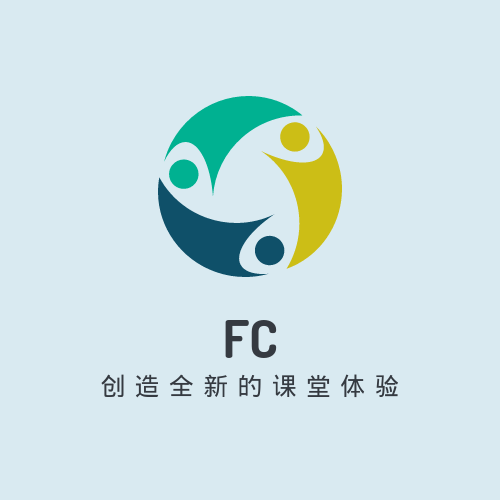

<h2 align="center">翻转课堂</h2>

为教师与学生创造全新的课堂体验！

 

## 开发流程与分支划分

Android、Web端、服务器端分别建立各自的文件夹，`android`、`web`、`server`。

1. 划分为 master 分支和 develop 分支

2. 所有的新功能在 feature 分支上开发

3. 新功能测试完毕后合并到 develop 分支

4. master 分支的一个提交代表着一个版本的发布

## 协议

Copyright (c) i@xlui.me. All Rights Reserved.

翻转课堂（FlippedClassroom）并非一个开源软件，作者及参与者保留全部的权利。公开源代码的目的是方便作者以及使用者审计代码，但是你仍然可以就以下方式合法使用本项目的全部代码和资源：

1. 个人使用
1. 以学习目的使用全部代码或部分代码

但你不可以：

1. 将本项目的部分或者全部代码和资源进行任何形式的再发行
1. 利用本项目的部分或者全部代码进行任何商业行为
